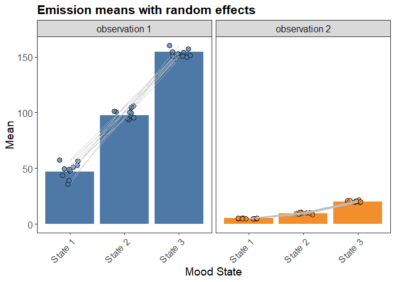

<!-- README.md is generated from README.Rmd. Please edit that file -->

# mHMMplot

<!-- badges: start -->

[](https://github.com/pepijnvink/mHMMplot/actions/workflows/R-CMD-check.yaml)
[](https://app.codecov.io/gh/pepijnvink/mHMMplot)
<!-- badges: end -->

The goal of mHMMplot is to visualize the output of Multilevel Hidden
Markov Models (MHMMs) using the
[ggplot2](https://ggplot2.tidyverse.org/) package. It is meant to be
used alongside the
[mHMMbayes](https://github.com/emmekeaarts/mHMMbayes/) package. Note
that the package is **a work in progress**. Please report any issues
using the [issues](https://github.com/pepijnvink/mHMMplot/issues) tab on
GitHub.

## Installation

You can install the development version of mHMMplot from
[GitHub](https://github.com/) with:

``` r
# install.packages("pak")
pak::pak("pepijnvink/mHMMplot")
```

## Example

To show an example of how the package can work, we first load the
mHMMplot package and the mHMMbayes package, and simulate some data, as
well as run a model.

``` r
# install.packages("mHMMbayes")
# install.packages("ggplot2")
library(mHMMplot)
library(mHMMbayes)
library(ggplot2)
## basic example code
# simulating multivariate continuous data
n_t <- 100
n <- 10
m <- 3
n_dep <- 2

gamma <- matrix(c(
  0.8, 0.1, 0.1,
  0.2, 0.7, 0.1,
  0.2, 0.2, 0.6
), ncol = m, byrow = TRUE)

emiss_distr <- list(
  matrix(c(
    50, 10,
    100, 10,
    150, 10
  ), nrow = m, byrow = TRUE),
  matrix(c(
    5, 2,
    10, 5,
    20, 3
  ), nrow = m, byrow = TRUE)
)
set.seed(42)
data_cont <- sim_mHMM(
  n_t = n_t, n = n, data_distr = "continuous",
  gen = list(m = m, n_dep = n_dep),
  gamma = gamma, emiss_distr = emiss_distr,
  var_gamma = .1, var_emiss = c(5^2, 0.2^2)
)

# Specify hyper-prior for the continuous emission distribution
manual_prior_emiss <- prior_emiss_cont(
  gen = list(m = m, n_dep = n_dep),
  emiss_mu0 = list(
    matrix(c(30, 70, 170), nrow = 1),
    matrix(c(7, 8, 18), nrow = 1)
  ),
  emiss_K0 = list(1, 1),
  emiss_V = list(rep(5^2, m), rep(0.5^2, m)),
  emiss_nu = list(1, 1),
  emiss_a0 = list(rep(1.5, m), rep(1, m)),
  emiss_b0 = list(rep(20, m), rep(4, m))
)

# Run the model on the simulated data:
# Note that for reasons of running time, J is set at a ridiculous low value.
# One would typically use a number of iterations J of at least 1000,
# and a burn_in of 200.
out_3st_cont <- mHMM(
  s_data = data_cont$obs,
  data_distr = "continuous",
  gen = list(m = m, n_dep = n_dep),
  start_val = c(list(gamma), emiss_distr),
  emiss_hyp_prior = manual_prior_emiss,
  mcmc = list(J = 100, burn_in = 5)
)
```

We can now, for example, create a plot to visualize the emission means,
using `plot_emiss()`, and include the subject-specific effects. We can
then use functions from the [ggplot2](https://ggplot2.tidyverse.org/)
package to further customize the plot, such as adding a title with
`ggtitle()`.

``` r
plot_emiss(mhmm_cont, type = "bar", subject_effects = TRUE, line = TRUE) +
  ggtitle("Emission means with random effects")
```


